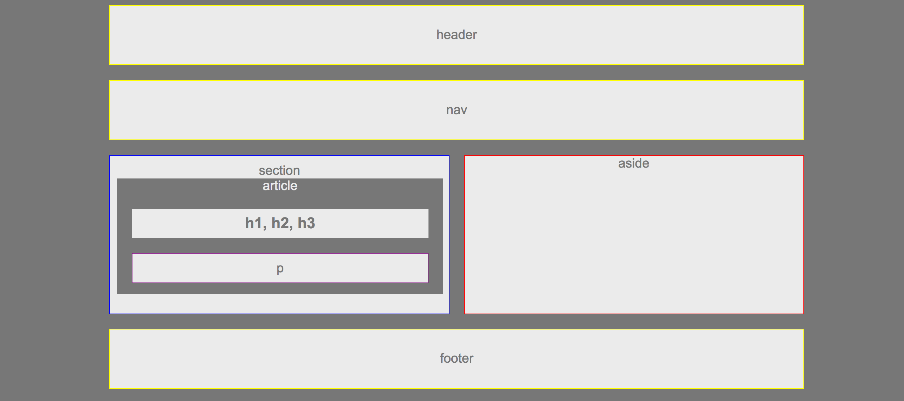

# HW-Wireframe
 This is a skeletion build of a basic webpage for a magazine or blog. 
 
 ### Example Build
 

This was a first experience with HTML and CSS. 
 - There were no libraries used, and really encouraged thinking like a designer.
 - Which element would be contained inside each element and spacing

 ### Finished Build

## Personal Experience
This was the first assignment I ever completed for the University of Washington Bootcamp. When I started out, I couldnt underdstand the file tree in VS Code, and HTML/CSS seemed fairly straignforward, until they didnt. The borders on each element are individually colored so that I could easily separate each piece and see their placement. I left the borders so that if I had any questions later I could look back and follow through my thoughts. 

I missed some of the elements (such as stacking the headers and spacing of elements) but that was part of learning, so that is the way it will stay. Learning is Work.

#### Instructions
1. HTML should have each of the following sections:
   * Header
   * Nav
   * Aside (With a Heading)
   * Section (With a Heading)
   * Article (With a Heading) contained within the Section
   * Headers contained within the Article
   * Paragraph contained within the Article
2. CSS should have styles for each of the following elements:
   * Body
     * font-family: 'Arial', 'Helvetica Neue', Helvetica, sans-serif;
     * color: '#777'
     * background: '#777'
     * width: '960px'
     * font-size: '18px'
   * Header, Nav, Section, Aside, and Footer
     * background: '#ebebeb'
   * Article
     * color: '#ebebeb',
     * background: '#777'
   * h1 and p
     * color: '#777',
     * background: '#ebebeb'
3. The widths of each section should be:
   * section: 495px

### Helpful Hints

* For a refresher on working with Git and GitHub, consult the GitHub Supplemental Guide we sent you in class.
* Don't forget to review these concepts: `float`, `padding`, `margin`, `display`, `overflow`, `clear` and `text-align`.
* Try to stay Positive!